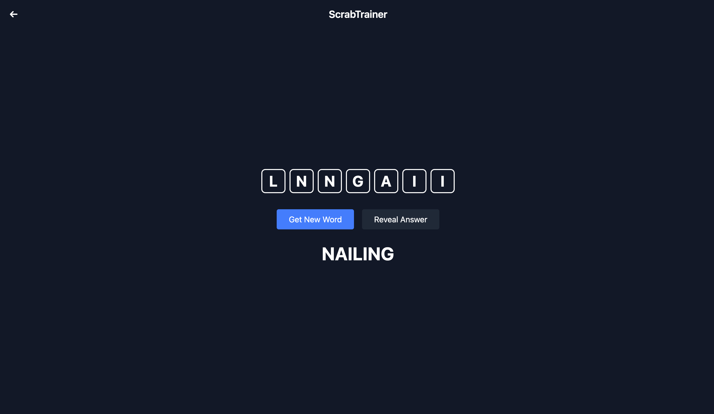
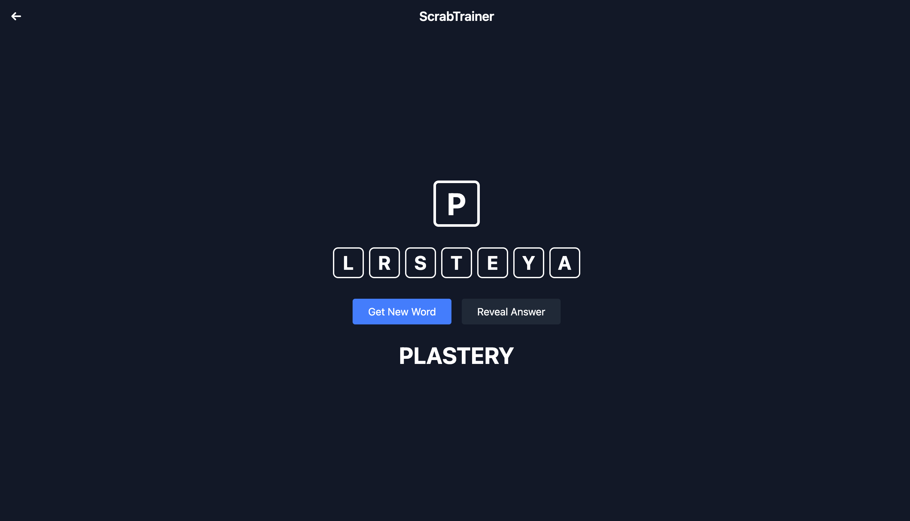

# ScrabTrainer
Scrabble bingo finder practice app.

## Game Modes

### Find the bingo

A bingo in scrabble is where you  use all 7 of your tiles. This mode presents you with 7 tiles, and you need to find the 7 letter word that can be made with those tiles.

### Bingo Hook

In an actual game, you will need to attach your 7 tiles to an existing word, making an at lest 8-letter long word. This game mode gives you 7 tiles, and a letter to "hook" your word onto.

